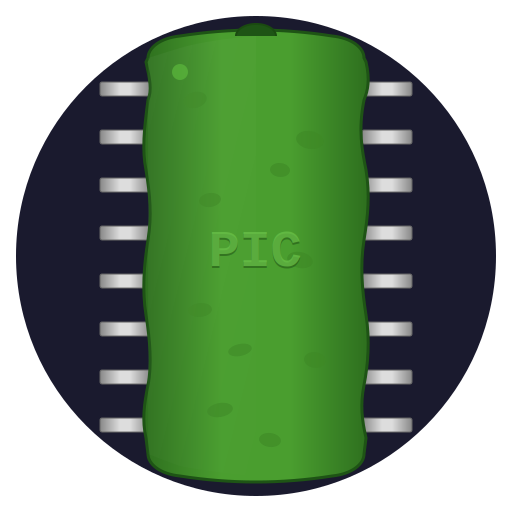

# pickle

<p align="center">
  
</p>

**pickle** is a native desktop pin configurator for Microchip dsPIC33 and PIC24 devices. It parses Microchip Device Family Pack (`.atpack`) data, renders package-aware pin assignment views, and generates compiler-friendly initialization code for PPS, port direction, oscillator, fuse, and CLC setup.

The name is a pun on **PIC** — Microchip's microcontroller line.

## What It Covers

- Interactive pin-table and peripheral-centric assignment views
- Package diagrams for DIP, SSOP, QFN, and QFP-style layouts
- PPS generation with explicit unlock/lock handling
- Port-mode generation for `ANSELx` and `TRISx`
- Optional oscillator pragma/init generation and dynamic fuse pragmas
- CLC designer with register preview and generated `CLCn*` writes
- Native open/save/export dialogs via Tauri
- Optional family-aware compile checks (`xc16-gcc` for PIC24, `xc-dsc-gcc` for dsPIC33) using installed or cached device packs, plus LLM-assisted datasheet verification

## Repo Layout

- `frontend/`: static HTML/CSS/JS loaded directly by the Tauri webview
- `frontend/static/app/`: unified frontend config, pure helper modules, split workflow/editor modules, and shell/verification/bootstrap scripts
- `src-tauri/`: Rust backend, parser, code generator, settings, and Tauri shell
- `docs/`: architecture notes, command contracts, code-generation behavior, and domain notes
- `tests/fixtures/`: fixture device JSON used by integration tests

## Frontend Config

Frontend polish settings live in [`frontend/static/app/config.js`](frontend/static/app/config.js).

- Theme palettes and CSS tokens are defined there and applied before first paint.
- UI constants such as theme-cycle labels, badge copy, and interaction timings are defined there.
- Future frontend polish work should update `config.js` first instead of adding new hard-coded values in JS or CSS.

## Quick Start

Prerequisites:

- Rust via `rustup`
- Tauri CLI via `cargo install tauri-cli`
- Optional: Microchip compilers for compile checks (`xc16-gcc` for PIC24, `xc-dsc-gcc` for dsPIC33)
- Optional: `OPENAI_API_KEY` or `ANTHROPIC_API_KEY` in the environment or repo-root `.env` for pinout verification

```bash
git clone https://github.com/jihlenburg/pickle.git
cd pickle

./scripts/validate.sh
cargo tauri dev
cargo tauri build
./scripts/release-app.sh
```

## Validation

```bash
./scripts/validate.sh
```

If you want the individual checks instead of the wrapper script:

```bash
cd src-tauri
cargo fmt --all -- --check
cargo test
cargo clippy --all-targets --all-features -- -D warnings

node --check frontend/static/pin_descriptions.js
for file in frontend/static/app/*.js; do node --check "$file"; done
node --test frontend/tests/*.test.js
```

## Settings And Runtime Data

pickle stores behavior settings in `settings.toml` under the platform app data directory:

- macOS: `~/Library/Application Support/pickle/settings.toml`
- Linux: `~/.local/share/pickle/settings.toml`
- Windows: `%APPDATA%\\pickle\\settings.toml`

The backend also manages mutable runtime caches and overlays in the first matching data root it can write to, including:

- `devices/`
- `dfp_cache/`
- `pinouts/`
- `clc_sources/`

`settings.toml` also persists compiler preferences under `[toolchain]` and `[toolchain.family_compilers]`, plus the generated file basename under `[codegen]`. The default output pair is `mcu_init.c` and `mcu_init.h`, but that basename remains configurable without changing the UI or generator code.

## Documentation

See [`docs/`](docs/) for current implementation details:

- [Architecture](docs/architecture.md): repo layout, runtime data flow, and module responsibilities
- [Tauri Commands](docs/commands.md): IPC contract between the frontend and Rust backend
- [Code Generation](docs/codegen.md): emitted files, init order, PPS/port handling, oscillator/fuse/CLC generation
- [Domain Knowledge](docs/domain.md): dsPIC33/PIC24 pin-routing concepts, fuses, oscillator behavior, overlays, and CLC notes

## License

MIT
